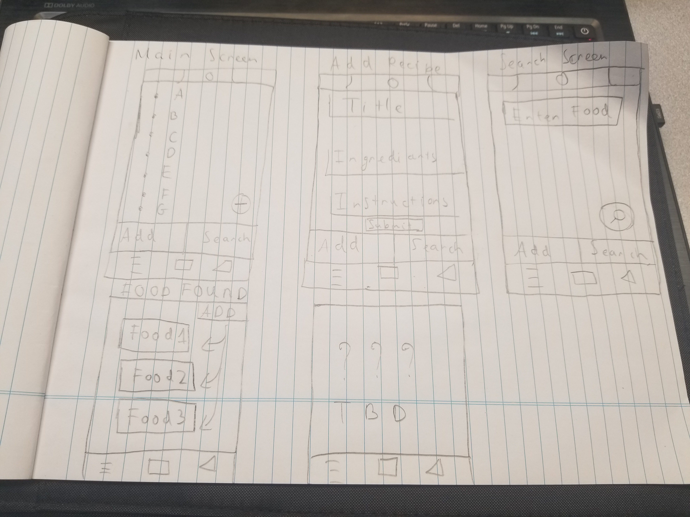

= CSCI C490 Project - Recipe Manager 

== Section 1 – Motivation for Your App

I will be making a recipe app, where user can create and store their own recipe in to a list. User will also be able to use the built-in search function to look up foods online along with its own recipes and the ability to add the products found online to their existing list along with its recipes. The target audiences for this app are people that want to know certain recipes to the foods that they haven't try and users that want a handy list to store their own recipes.

Some of the recipe/food apps that have similar functions can be primarily found on this website:

https://www.digitaltrends.com/mobile/best-recipe-apps/

I haven't tried them all but I've looked at BBC Good Food and its idea of a built in search function is similar to my app. Also Paprika is an excellent that was recommended to me by a certain someone. All the apps listed can be found on both Android and iOS, including the apps listed on the linked website.  

== Section 2 - Meeting Minimum Requirements

=== 2.1 User Interface

There are two main screens on the app. Those screens are the default adding recipe screen and the search recipe screen.

Also I think a list would work better in portrait screen rather than landscape, since there isn't a lot of information being displayed for each product/recipe and for a long list your finger would feel more natural doing a downward swiping motion going through a list in portrait mode rather than in landscape. It's kinda like going through your phone number list, short amount of informations being displayed to me means easier manipulation of a smaller controlled field, in this case a list.

== Recipe
 

There are two sub-screens on the main screen:

• Default screen

  ∙ User can see a list of recipe that they've created
  
  ∙ User have the option to click one of the listed recipe to edit the recipe chosen
  
  ∙ User can click on the add button to assign their own recipe to the list  
  
• Recipe Screen

   ∙ User input into open field the name and ingredients on how to make the recipe.
   
   ∙ User can click submit after done to add the recipe to their list.
   
   
There are two sub-screens to the Search Screen:

• Default screen

  ∙ User can enter their choosen recipe and click search, the built in search engine will then proceed to look up online and find the closest match to user's chosen product
  
== Handrawn layouts

  
=== 2.2 Data Persistence

Data in this app will be stored in a SQLite database. There aren't much data to be store so data will be stored on the device. Data will be added when user choose to add a recipe of their own into their respective fields, data will be retrieved at the onCreate for the createtable function, there will also be an onUpgrade that will drop the old table and add a new table once triggered. 

=== 2.3 Communication
This app will communicate with the outside world via its search function. The app will be using a simple RESTAPI called recipepuppy, this api lets you search through recipe puppy database of over a million recipes by keyword and/or by search query. The api is accessible at http://www.recipepuppy.com/api/. I found this API by googling recipe api, I haven't decided on a Rest Client yet to retrive and return the json but I've looked online and found that people mostly recommend RetroFit so I'll look into that.

== Section 3 – MVC Breakdown of Your App

=== 3.1 View Descriptions

Some xml files activity main, activity main for web, add recipe page, save recipe page, result of saved recipe as a list on the home screen, list of item, searchs that found online are saved, results that are saved.

=== 3.2 Model Descriptions

The model will contain 3 main things, file to store recipe, file to host custom recipe and file to store the result of recipe found onlnine. App's model will use SQLite database to store values listed above while also utilizing recipepuppy API for its search engine and the values found online will be forwarded to the sqlite tables. The table for recipe will have its id, title, ingeredients, instructions and hopefully picture. The custom recipe in which user can port recipe found online to their list's table will have its link ( name) ingridents, title and hopefully its thumbnail that are use on the cloud can be imported too.

=== 3.3 Controller Descriptions

SaveRecipe controller will control the custom recipe that are saved into the list. CustomRecipe will control what are found online that will be store onto the list. Add recipe will call saverecipe to make sure when adding your recipe to the list the progress are saved. addrecipeweb will make sure that recipes found online are saved when prompt to added onto your list.

